# Mandareen: Your Personal AI Mandarin Tutor

Mandareen is an AI-driven web application designed to provide a personalized and immersive Mandarin learning experience. It started as a personal project to create a better, more engaging learning tool and has evolved into a feature-complete platform that adapts to your unique learning pace and style.

## The Story Behind Mandareen

The journey of Mandareen began with a simple goal: to learn Mandarin more effectively. Frustrated with the limitations of existing apps—generic content, restrictive paywalls, and a lack of engaging practice—I set out to build my own tool. The idea was to create an AI-powered tutor that could generate unlimited, personalized lessons on topics I was actually interested in, at the precise difficulty I needed.

This project chronicles the journey of building that vision, from a robust backend to complex, real-time AI features that bring the learning experience to life.

## Screenshots

### Core Learning Experience

|                    Dashboard                     |                       Placement Test                       |                   AI Lessons                    |
| :----------------------------------------------: | :--------------------------------------------------------: | :---------------------------------------------: |
| 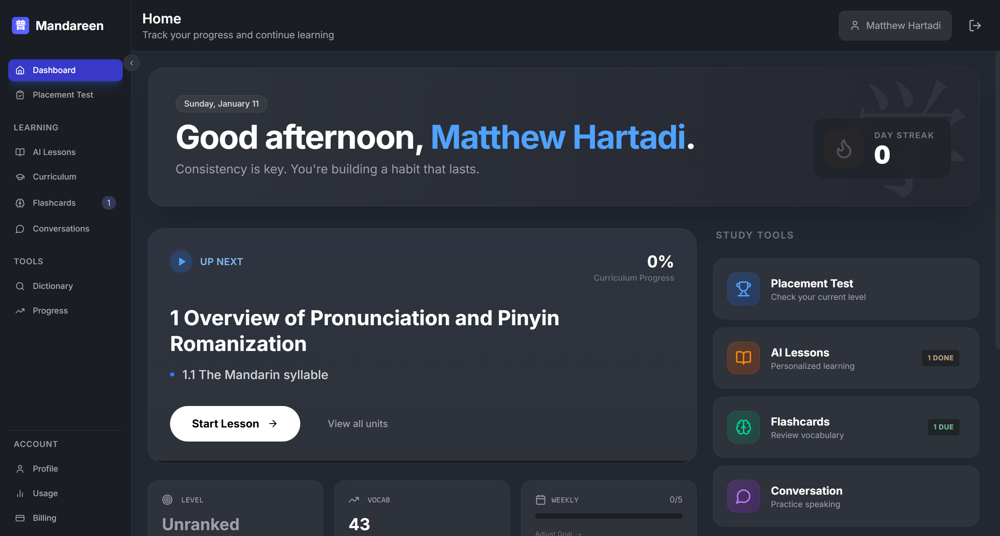 | 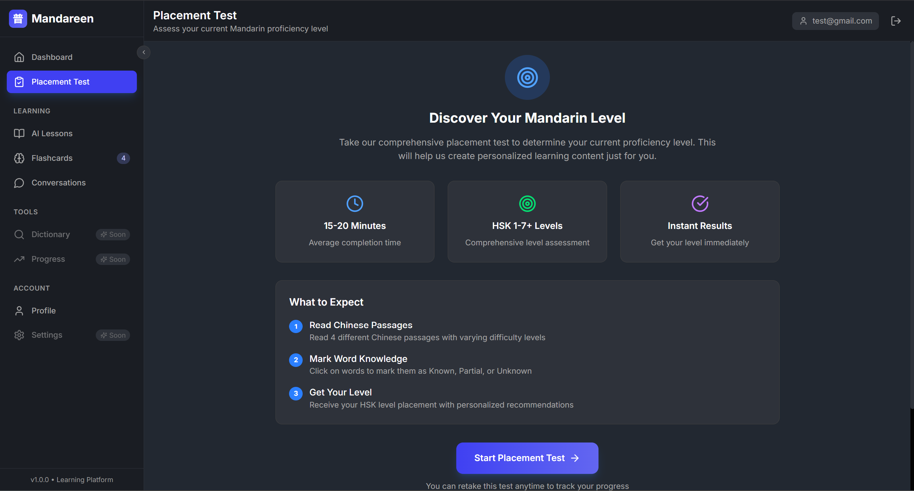 | 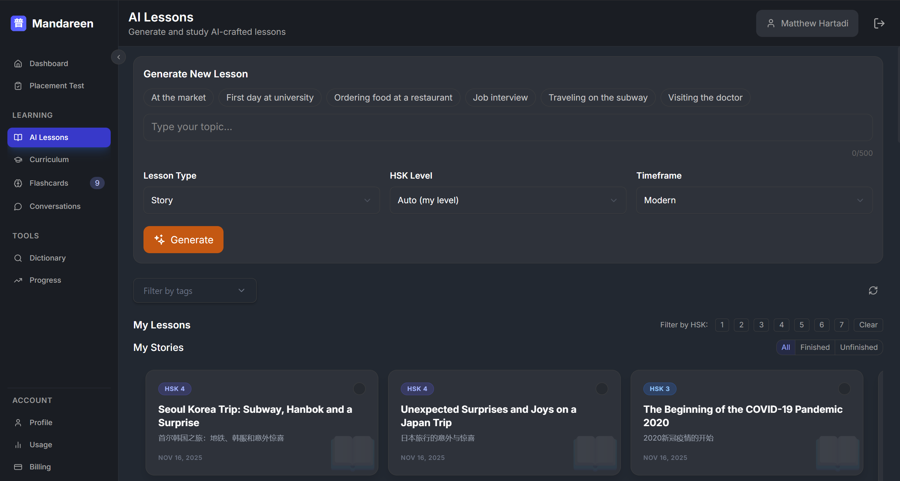 |

### Lesson Viewing & Interaction

|                          Story Lesson Viewer                          |                           Dialogue Lesson Viewer                            |                    Word Popup & Flashcard Capture                     |
| :-------------------------------------------------------------------: | :-------------------------------------------------------------------------: | :-------------------------------------------------------------------: |
| 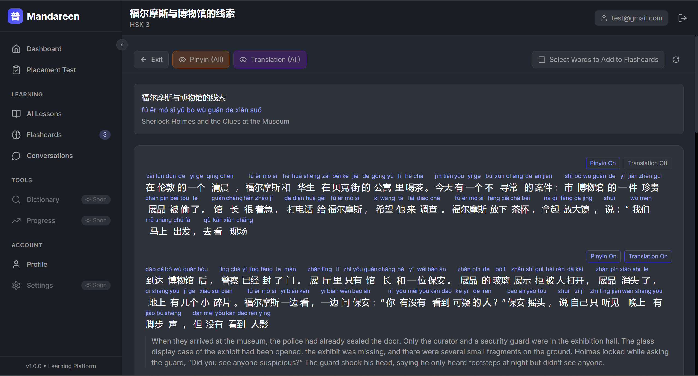 | 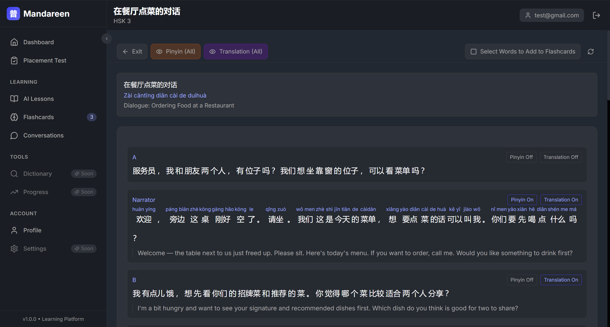 | 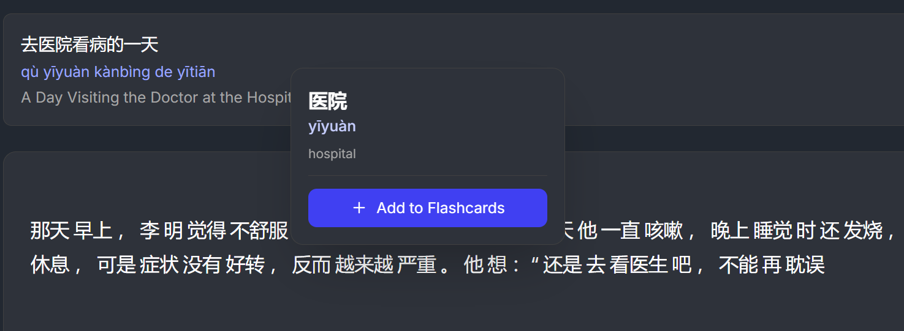 |

### Practice & Review

|                     Flashcard Review                     |                    Flashcard Study Session                    |                  AI Conversation Practice                  |
| :------------------------------------------------------: | :-----------------------------------------------------------: | :--------------------------------------------------------: |
| 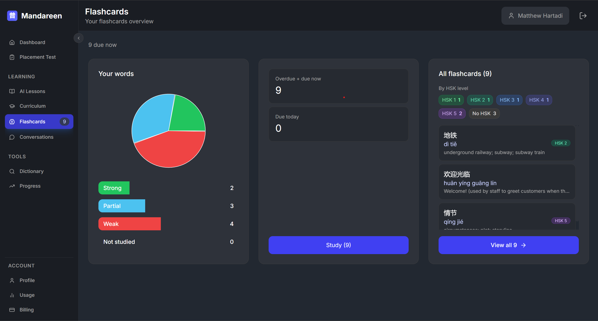 | 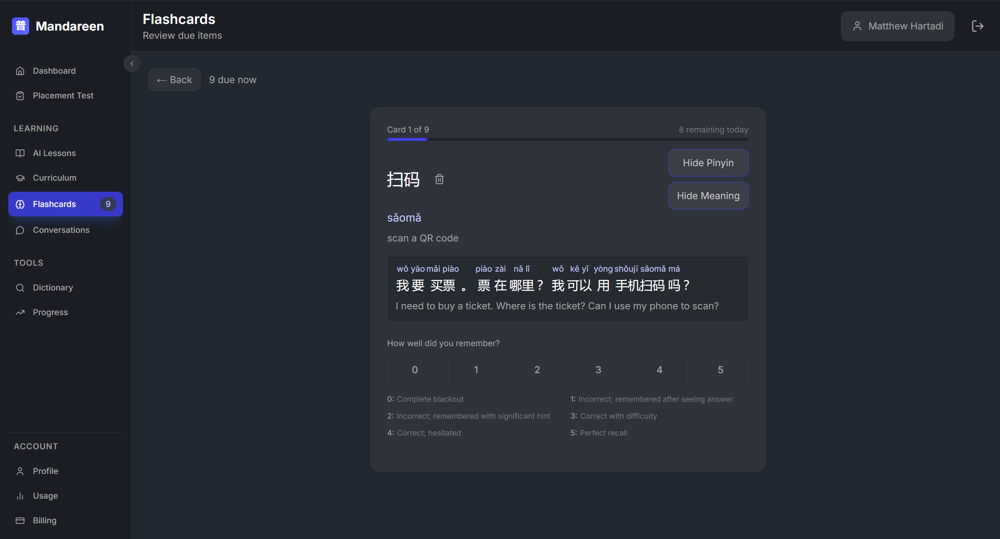 | 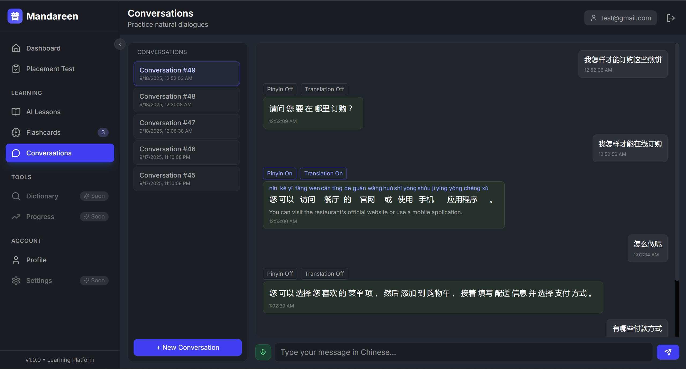 |

### Curriculum & Structured Learning

|                        Curriculum Browser                        |                     Curriculum Unit View                     |                           Curriculum Lesson Viewer                           |
| :--------------------------------------------------------------: | :----------------------------------------------------------: | :--------------------------------------------------------------------------: |
| 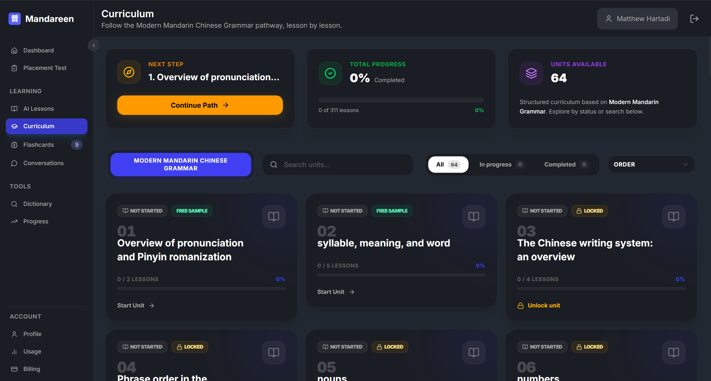 | 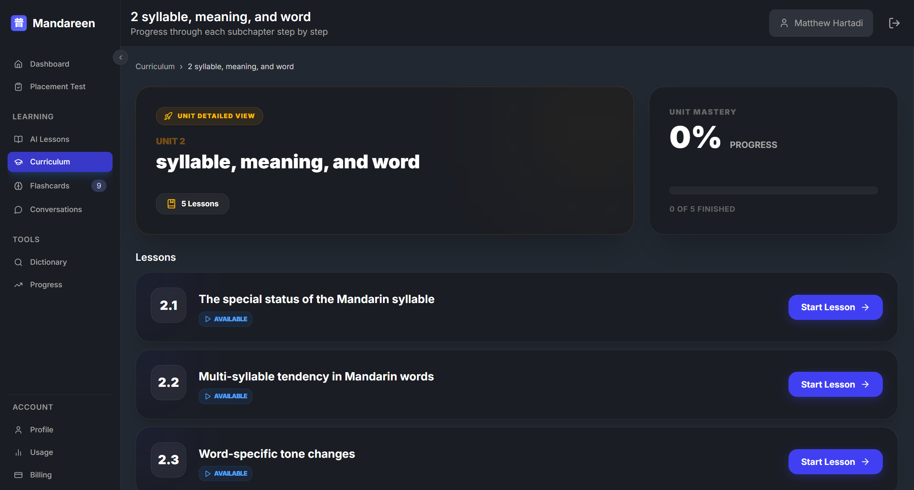 | 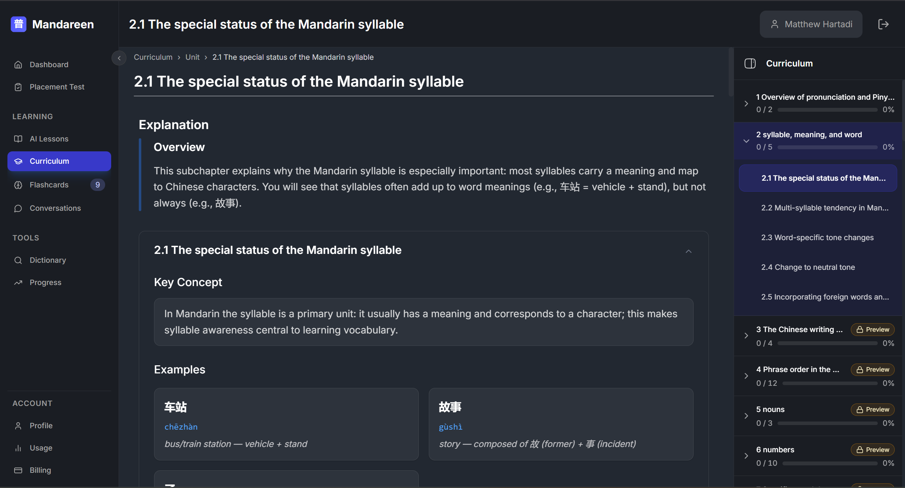 |

### Tools & Progress

|                     Dictionary                     |               Progress Dashboard               |                Lesson Quiz Interface                 |
| :------------------------------------------------: | :--------------------------------------------: | :--------------------------------------------------: |
| 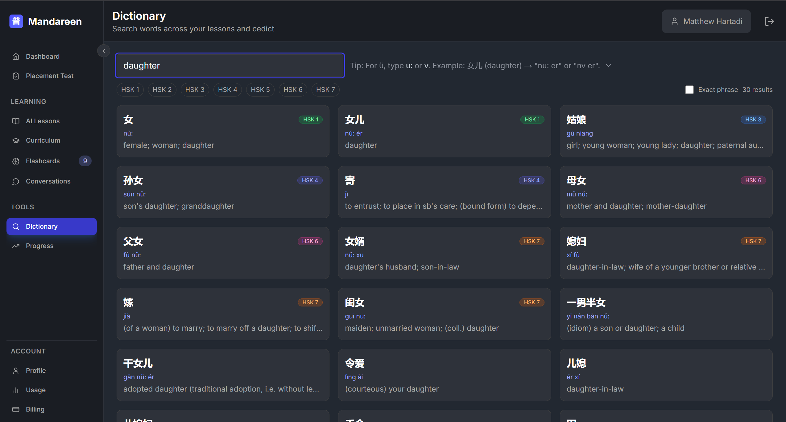 | 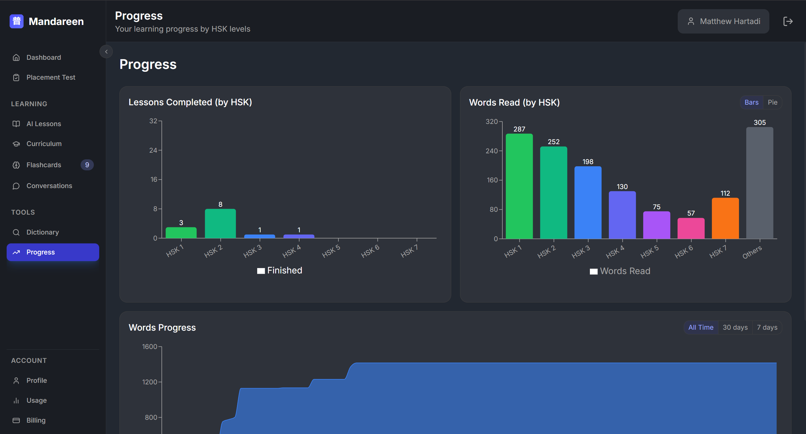 | 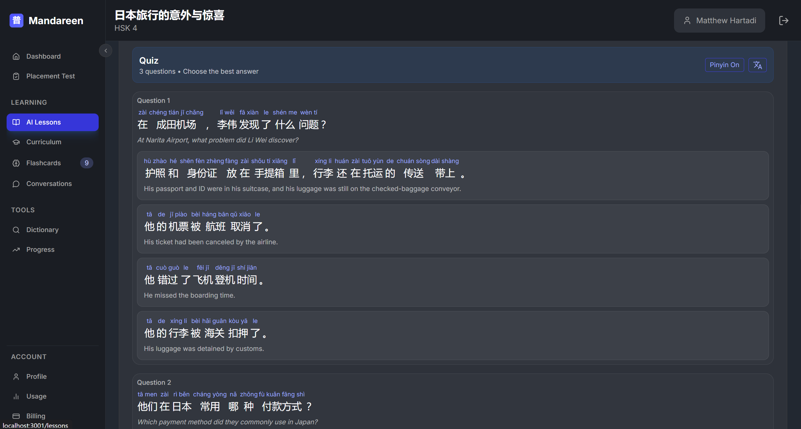 |

### Account Management

|                 User Profile                 |             Usage Dashboard              |            Billing & Subscription            |
| :------------------------------------------: | :--------------------------------------: | :------------------------------------------: |
| 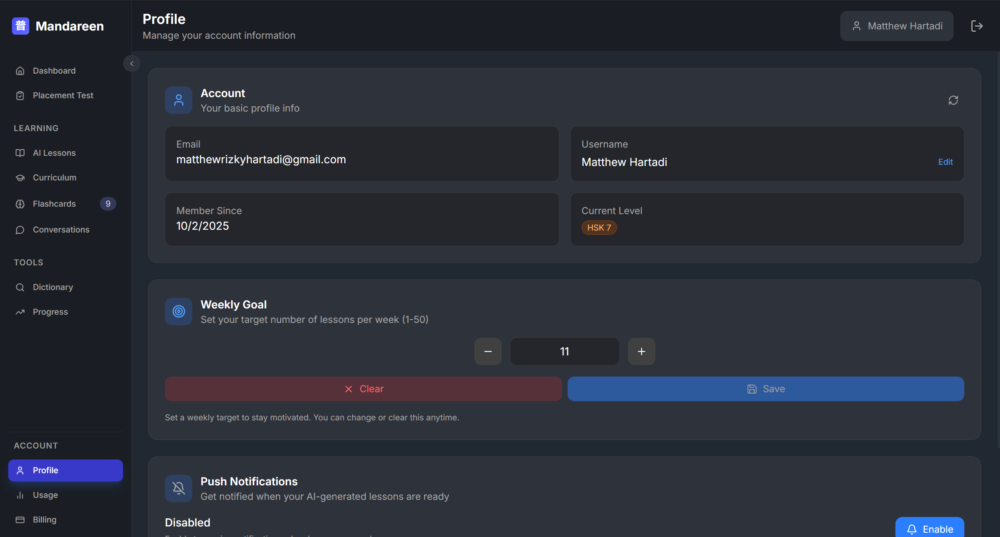 | 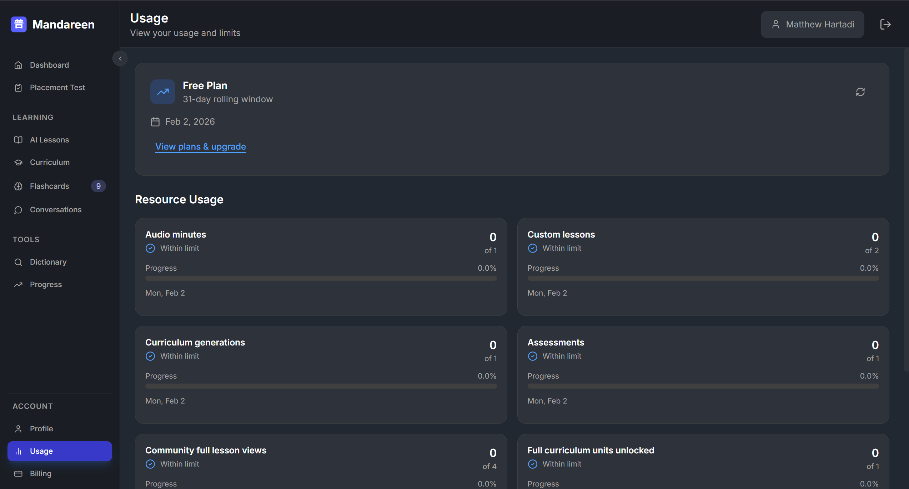 | 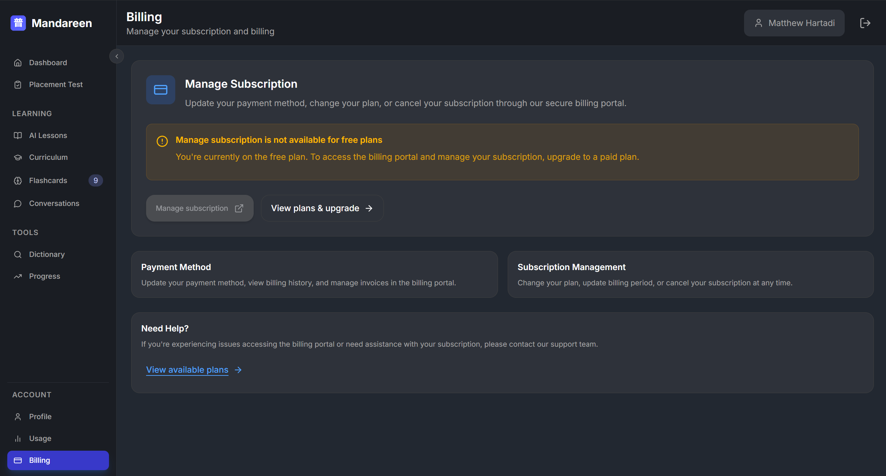 |

## Core Features

Mandareen combines a structured curriculum with powerful AI tools to create a comprehensive learning ecosystem.

### 🎯 Personalized Learning Path

- **Adaptive Proficiency Assessment:** Take an initial placement test to determine your HSK level (1-9). The app uses AI-generated passages with rising difficulty where you mark words as "Known," "Partial," or "Unknown" to accurately place you. Results include detailed skill breakdowns and retake options.
- **Structured Curriculum:** Follow a guided learning path based on the _Modern Mandarin Chinese Grammar_ textbook. The curriculum includes 60+ grammar units and 311 lessons, organized progressively with completion tracking and on-demand generation.
- **Freestyle AI-Generated Lessons:** Generate custom stories and dialogues on any topic, tailored to your proficiency level. Choose from story or dialogue formats, select HSK level (or auto from placement), pick a timeframe (modern, mythic, imperial, pre-modern, futuristic), and provide a topic prompt. All lessons are shareable in the community library.

### 💬 Interactive Content & Practice

- **Real-Time Conversation Practice:** Engage in speech-to-speech conversations with an AI tutor. The system provides real-time transcription, pinyin, translation, and audio playback for every message. Configure target HSK level and receive reply suggestions to keep dialogues flowing naturally.
- **AI Tutor Notes:** Get instant, context-aware grammar explanations and tips for AI messages, powered by a Retrieval-Augmented Generation (RAG) system. Notes include grammar points, brief explanations, examples, and tips—all segmented for clickable learning.
- **Interactive Lesson Viewer:** Read lessons with toggles for pinyin and translation to suit your learning style. Click any word to see definitions, add to flashcards, or view context. Multi-select mode allows capturing multiple words at once.

### 📚 Vocabulary & Review

- **Seamless Flashcard Capture:** Click any word in a lesson, conversation, dictionary, or assessment to see its definition and instantly add it to your flashcards. The source sentence is automatically saved to provide context during review.
- **Spaced Repetition System (SRS):** Reinforce your learning with a built-in flashcard system based on the SM-2 algorithm. Cards are organized into buckets (not studied, weak, partial, strong) with due/due-today counts. Review flow includes pinyin/translation toggles, example sentences, and HSK tagging.
- **Comprehensive Dictionary:** A full-featured, searchable dictionary with support for hanzi, pinyin (including ü via u:/v), and English searches. Features HSK filtering, exact-phrase toggle, pinned top matches, infinite scroll pagination, and acts as a lookup hub throughout the app.

### 📊 Gamification & Progress Tracking

- **Words Read Counter:** Track the total number of unique words you've encountered across all lessons and conversations.
- **Daily Lesson Streak:** Stay motivated by tracking your daily study consistency with streak counters and carry-over days.
- **HSK Progress Visualization:** View comprehensive charts showing your progress in words read and lessons completed, broken down by HSK level. Includes bar/pie chart toggles, timeline views (7/30/all days), and per-level totals with percentages.
- **Weekly Progress Goals:** Track weekly lesson completion with visual progress indicators and goal tracking.
- **Lesson Completion Quizzes:** AI-generated multiple-choice quizzes at the end of each lesson test comprehension with 3 questions, rationales, and segmented text. Perfect scores mark lessons as completed.

### 🎓 Curriculum-Based Learning

- **60+ Grammar Units:** Structured curriculum sourced from Modern Mandarin Chinese Grammar, organized into units with search, sort, and filter capabilities.
- **311 Lessons:** Comprehensive lesson library with completion badges, free-sample gating, and on-demand generation.
- **Guided Navigation:** Seamless navigation between previous/next units and lessons with progress tracking.
- **Activity Generation:** Lessons include Readings, Grammar Explanations, and Quizzes dynamically generated using RAG context from the textbook.

### 🤝 Community & Sharing

- **Community Lessons Library:** Browse and discover AI-generated lessons created by all users. Stories and dialogues are shareable and reusable once generated.
- **Shared Curriculum Generation:** When curriculum lessons are generated, they benefit all users through shared caching, reducing generation costs and improving access.

### 🔐 Authentication & User Management

- **Email/Password Authentication:** Secure registration and login with JWT-based session management.
- **Google OAuth:** One-click sign-in with Google account integration.
- **User Profiles:** Manage account settings, view assessment history, and track learning statistics.
- **Usage Dashboard:** Monitor API usage, quota limits, and resource consumption for assessments, conversations, and lesson generation.

## Technology Stack

Mandareen is a monorepo built with a modern, scalable tech stack.

### Frontend

- **Framework:** Next.js 16+ (React), TypeScript
- **Styling:** Tailwind CSS, Shadcn/UI components
- **State Management:** Zustand
- **PWA:** `next-pwa` for Progressive Web App capabilities
- **Data Fetching:** TanStack Query (React Query)
- **Animations:** Framer Motion

### Backend

- **Framework:** NestJS, TypeScript
- **Database:** PostgreSQL with Prisma ORM
- **Vector Database:** `pgvector` extension for RAG system with HNSW indexing
- **Storage:** Supabase Storage for audio files

### AI & Services

- **LLMs:** OpenAI API
  - GPT models for text generation
  - Speech-to-Text (STT) and Text-to-Speech (TTS) for audio playback
- **Embeddings:** Google Gemini (`gemini-embedding-001`)
- **RAG System:** Retrieval-Augmented Generation using pgvector for context-aware responses

### Infrastructure

- **Frontend Deployment:** Vercel
- **Backend Deployment:** Railway
- **Storage:** Supabase Storage
- **Real-time Communication:** Server-Sent Events (SSE) for streaming responses, including real-time audio processing and AI responses

## Architecture

The project is architected as a monorepo with a Next.js frontend and a NestJS backend.

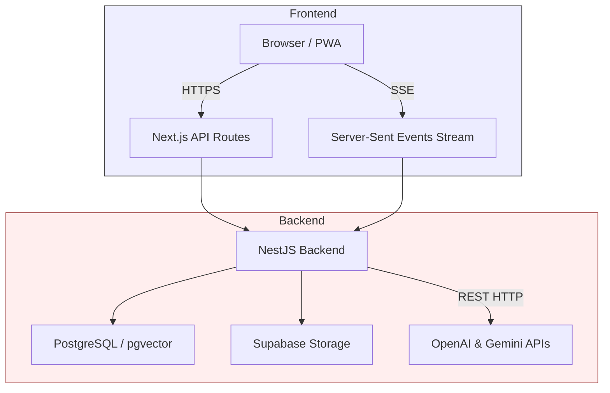

### RAG System Architecture

The AI's intelligence is powered by a **Retrieval-Augmented Generation (RAG)** system. It uses a `pgvector` database to perform HNSW-indexed similarity searches on a knowledge base derived from a Mandarin grammar textbook. This allows the AI to provide highly accurate, context-aware grammar notes and generate structured lesson content.

**Key Components:**

- **RAG Sources:** Structured knowledge base from Modern Mandarin Chinese Grammar
- **Embeddings:** Vector representations using Google Gemini embeddings
- **Similarity Search:** HNSW-indexed cosine distance searches for context retrieval
- **Context-Aware Generation:** LLM prompts enriched with retrieved grammar context
- **Fallback Mechanisms:** Graceful degradation when RAG is unavailable

### Performance Optimizations

- **Batched Database Queries:** Optimized vocabulary lookups reduce query count by 99.8% (5,309 → 10 queries for long texts)
- **Context-Aware Pinyin Disambiguation:** Intelligent pinyin selection based on surrounding context
- **In-Memory LRU Caching:** Multi-layer in-memory caching with LRU eviction for vocabulary lookups, timeline data, and billing plans
- **Streaming Responses:** Server-Sent Events for real-time AI responses without blocking
- **Progressive Web App:** Offline capabilities and app-like experience

## Project Status

**Feature-Complete.** All core features described above are fully implemented and production-ready. The platform includes:

✅ Complete authentication system (Email/Password + Google OAuth)  
✅ Adaptive proficiency assessment with HSK placement  
✅ AI-generated lessons (stories & dialogues) with community sharing  
✅ Structured curriculum (60+ units, 311 lessons) with on-demand generation  
✅ Real-time conversation practice with speech-to-speech  
✅ Flashcard system with SM-2 spaced repetition  
✅ Comprehensive dictionary with HSK filtering  
✅ Progress tracking with HSK-level visualizations  
✅ Lesson completion quizzes  
✅ RAG-powered grammar notes and context-aware responses

The current focus is on user testing, performance optimization, and continuous refinement based on user feedback.

## Key Differentiators

- **HSK-Level Targeting:** Everything is tuned to your HSK level—lessons, conversations, vocabulary, and assessments
- **Audio-First Speaking Practice:** Real-time speech-to-speech conversations with AI tutor, not just text chat
- **Grammar-Grounded Content:** Curriculum and grammar notes derived from authoritative textbook sources via RAG
- **Unified Learning Flow:** No need to jump between apps—everything is integrated in one cohesive experience
- **Adaptive & Personalized:** AI generates unlimited content tailored to your interests, level, and learning style
- **Community-Driven:** Share and discover lessons created by other learners

## Technical Highlights

- **Monorepo Architecture:** Clean separation between frontend and backend with shared types
- **Type Safety:** End-to-end TypeScript with Prisma-generated types
- **Real-time Features:** SSE streaming for audio processing, AI responses, and live progress updates
- **Scalable AI Integration:** Quota-aware generation, retry logic, and efficient caching
- **Production-Ready:** Deployed on Railway (backend) and Vercel (frontend), with error handling and comprehensive logging
- **Accessibility:** Keyboard navigation, screen reader support, and reduced-motion preferences

---

_Mandareen represents a complete, production-ready Mandarin learning platform that combines the best of structured curriculum learning with the flexibility and personalization of AI-powered content generation._
